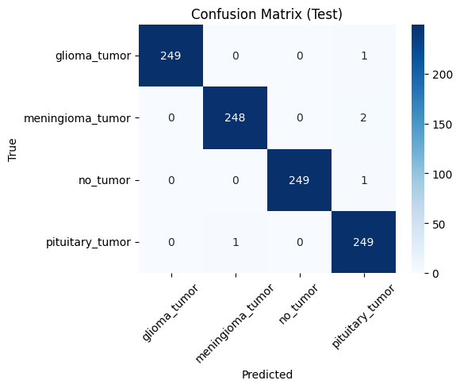
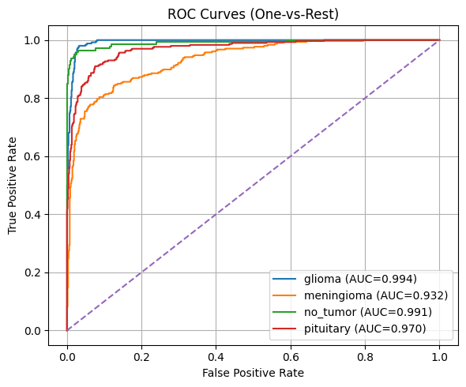
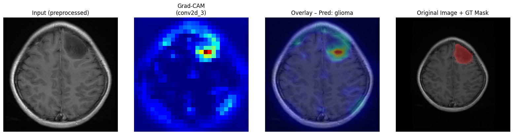

# Brain MRI Tumor Classification (4-class CNN) + Grad-CAM
**Dicoding Machine Learning Bootcamp 2025 — Portfolio Project**

4-class brain MRI tumor classification (CNN) with Grad-CAM interpretability and evaluation artifacts.

## Overview
This project builds a 4-class brain MRI tumor classifier to predict:
- **glioma**, **meningioma**, **no_tumor**, **pituitary**

It includes an inference pipeline, evaluation artifacts, and interpretability checks using **Grad-CAM** to validate model attention regions.

## Goal
- Classify brain MRI images into 4 classes and report robust evaluation metrics.
- Provide interpretable visual explanations (Grad-CAM) as a sanity check for model focus.

## Dataset
- **Source:** https://www.kaggle.com/datasets/pradeep2665/brain-mri
- **Classes:** 4 (glioma, meningioma, no_tumor, pituitary)
- **Splits:** 80/10/10
- **Test set size:** **1,000** images

## Approach
### Model
- **Architecture:** Custom CNN (Sequential): Conv2D(32/64/128/256, 3×3, ReLU, same) + BatchNorm + MaxPool; GlobalAveragePooling2D; Dense(128, ReLU, L2=1e-4) + Dropout(0.5, 0.3); Softmax output  
- **Training setup:** Input size 224×224 RGB; seed=42; trained using Keras data generators (batch size: 64); augmentation: ImageDataGenerator with rescale (1/255) + augmentation: rotation (±5°), width/height shift (0.1), zoom (0.12), horizontal flip, shear (0.05), brightness range (0.9–1.1), fill_mode='nearest'; epochs: 60 
- **Loss / Optimizer:** Categorical Cross-Entropy with Adam (lr=1e-3); metric: accuracy.

### Interpretability
- **Grad-CAM:** Generates heatmaps to visualize model attention regions.
- **Sanity check:** Visual inspection to ensure the model attends to relevant regions (and not background artifacts).

## Results (Test)
Evaluation on **1,000 test images**:
- **Accuracy:** **86.40%**
- **Macro F1:** **0.864**
- **Weighted F1:** **0.863**
- **ROC-AUC (OVR):** **0.93–0.99** (per class)

### Per-class performance (Test)
| Class      | Precision | Recall | F1-score |
|------------|-----------|--------|----------|
| glioma     | 0.9022    | 0.9803 | 0.9396   |
| meningioma | 0.7987    | 0.8039 | 0.8013   |
| no_tumor   | 1.0000    | 0.7357 | 0.8477   |
| pituitary  | 0.8498    | 0.8867 | 0.8679   |

### Key observations
- **no_tumor recall (0.736)** is lower than other classes → model is conservative predicting *no_tumor*.
- **meningioma** remains the most ambiguous class (lowest F1 and AUC among classes).


## Evaluation Artifacts

### Confusion Matrix (Test)


### ROC-AUC (One-vs-Rest)


### Grad-CAM Examples


## How to Run
### Environment
- Python: _[e.g., 3.10]_  
- Core libs: TensorFlow/Keras, NumPy, Pandas, Matplotlib, scikit-learn

### Option A — Run via Notebook (recommended for this repo)
1. Open the notebook: `Submission-Akhir_Image-Classification.ipynb`
2. Run cells top-to-bottom.
3. Export artifacts (confusion matrix, ROC, Grad-CAM examples) to `results/`.

### Option B — Scripts (if you later modularize)
1. Install dependencies:
   ```bash
   pip install -r requirements.txt
   ```
2. Run inference:
   ```bash
   python inference.py --input_dir <TEST_DIR> --output_csv inference_output/test_predictions.csv
   ```

## Limitations & Next Steps
- Improve **no_tumor recall** via class weighting / focal loss / threshold tuning.
- Confirm leakage-safe split (patient-level split if applicable).
- Expand error analysis by reviewing misclassified samples and Grad-CAM heatmaps.

## Links
- Notebook (reference): [Brain-MRI-Image-Classification.ipynb](Brain-MRI-Image-Classification.ipynb)
- Artifacts: [results/](results/)
